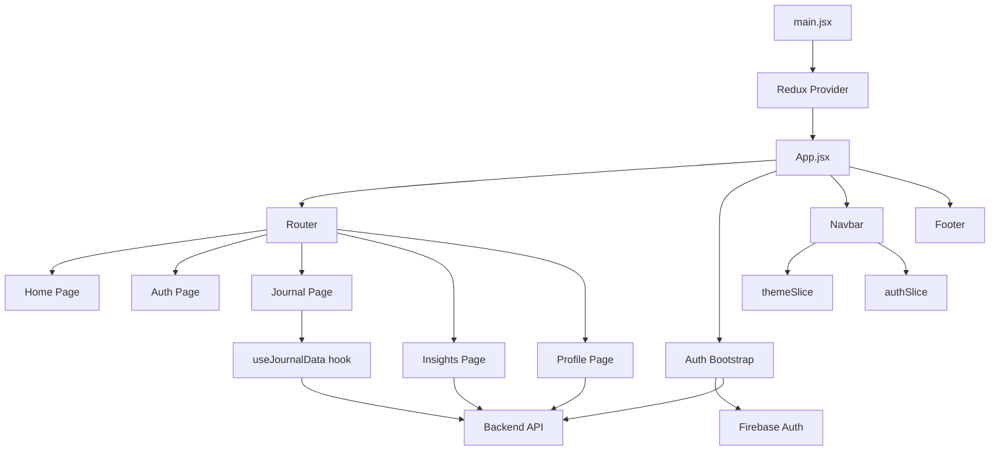

The `frontend` folder is a Vite + React 19 app with Redux for global state, Firebase for authentication, React Router for navigation, Tailwind for styling, and Framer Motion for UI animation.

The app boots from [main.jsx](/F:/Jagriti/Bhaav-Book/frontend/src/main.jsx), which wraps [App.jsx](/F:/Jagriti/Bhaav-Book/frontend/src/App.jsx) in the Redux `Provider`. `App.jsx` is the real shell: it sets up the router, restores auth with Firebase `onAuthStateChanged`, refreshes tokens on intervals, checks expiry on focus/visibility, and defines the main routes:
- `/` -> home landing page
- `/auth/:authType` -> login/signup
- `/profile` and `/profile/:id` -> own or public profile
- `/journal` -> journal workspace
- `/insights` -> insights workspace

The main folders are:
- [src/components](/F:/Jagriti/Bhaav-Book/frontend/src/components): almost all UI, grouped by feature (`auth`, `home`, `journal`, `insights`, `profile`, `pages`, `Navbar`)
- [src/store](/F:/Jagriti/Bhaav-Book/frontend/src/store): Redux setup and slices
- [src/config](/F:/Jagriti/Bhaav-Book/frontend/src/config): backend API base URL and Firebase setup
- [src/Hooks](/F:/Jagriti/Bhaav-Book/frontend/src/Hooks): reusable logic, mainly journal data fetching/mutations
- [src/assets](/F:/Jagriti/Bhaav-Book/frontend/src/assets): logos/images

State is simple and centered in three slices:
- [authSlice.js](/F:/Jagriti/Bhaav-Book/frontend/src/store/slices/authSlice.js): login/register/google auth, token verification, token refresh, logout, user state
- [profileSlice.js](/F:/Jagriti/Bhaav-Book/frontend/src/store/slices/profileSlice.js): profile update requests
- [themeSlice.js](/F:/Jagriti/Bhaav-Book/frontend/src/store/slices/themeSlice.js): dark/light mode persisted in `localStorage`

Feature flow looks like this:
- Auth UI in [Login.jsx](/F:/Jagriti/Bhaav-Book/frontend/src/components/auth/Login.jsx) and [Signup.jsx](/F:/Jagriti/Bhaav-Book/frontend/src/components/auth/Signup.jsx), using Firebase first and then backend auth endpoints
- Navigation/search/theme/account handling in [Navbar.jsx](/F:/Jagriti/Bhaav-Book/frontend/src/components/Navbar/Navbar.jsx)
- Journal feature in [JournalPage.jsx](/F:/Jagriti/Bhaav-Book/frontend/src/components/pages/JournalPage.jsx), with most CRUD/data logic inside [useJournalData.js](/F:/Jagriti/Bhaav-Book/frontend/src/Hooks/useJournalData.js)
- Insights feature in [InsightPage.jsx](/F:/Jagriti/Bhaav-Book/frontend/src/components/pages/InsightPage.jsx), which directly fetches/paginates insight data
- Profile feature in [ProfilePage.jsx](/F:/Jagriti/Bhaav-Book/frontend/src/components/pages/ProfilePage.jsx) and [ProfileCard.jsx](/F:/Jagriti/Bhaav-Book/frontend/src/components/profile/ProfileCard.jsx)

A couple of important implementation patterns stand out:
- Shared visual style is repeated across pages: sky/blue gradient backgrounds, blurred circles, dark mode variants
- Backend communication is mostly plain `fetch`, not Axios or React Query
- Auth token is stored in `localStorage` as `authToken`
- `API_BASE_URL` comes from [api.js](/F:/Jagriti/Bhaav-Book/frontend/src/config/api.js), so this app depends heavily on environment variables
- Journal logic is nicely isolated in a custom hook, but Insights/Profile still fetch directly inside components

If you want, I can do the next step and give you either:
1. a page-by-page walkthrough,
2. a component relationship map,
3. a data-flow/auth-flow explanation,
4. or a “what should be improved” review of this frontend.


**Architecture**

This frontend is organized as a feature-based React app with a thin app shell and mostly page-local state.

At the top level:
- [main.jsx](/F:/Jagriti/Bhaav-Book/frontend/src/main.jsx) mounts React and injects the Redux store.
- [App.jsx](/F:/Jagriti/Bhaav-Book/frontend/src/App.jsx) is the application shell.
- [store.js](/F:/Jagriti/Bhaav-Book/frontend/src/store/store.js) wires global Redux slices.
- [firebase.js](/F:/Jagriti/Bhaav-Book/frontend/src/config/firebase.js) initializes Firebase auth.
- [api.js](/F:/Jagriti/Bhaav-Book/frontend/src/config/api.js) exposes the backend base URL.

The architecture is essentially 5 layers:

1. App shell
- Router
- global auth bootstrap
- token refresh / expiry checks
- global layout pieces like navbar, footer, scroll reset, loader

2. Global state
- `auth`: logged-in user, token, auth lifecycle
- `theme`: dark/light mode
- `profile`: profile update request state

3. Feature pages
- home
- auth
- journal
- insights
- profile

4. Feature components
- each page composes its own UI pieces from a feature folder

5. Infrastructure/helpers
- Firebase auth
- backend `fetch` calls
- custom hooks like [useJournalData.js](/F:/Jagriti/Bhaav-Book/frontend/src/Hooks/useJournalData.js)

**System Flow**



**Folder Roles**

- [src/components/pages](/F:/Jagriti/Bhaav-Book/frontend/src/components/pages): route-level pages
- [src/components/home](/F:/Jagriti/Bhaav-Book/frontend/src/components/home): landing page sections
- [src/components/auth](/F:/Jagriti/Bhaav-Book/frontend/src/components/auth): login/signup forms
- [src/components/journal](/F:/Jagriti/Bhaav-Book/frontend/src/components/journal): journal-specific UI
- [src/components/insights](/F:/Jagriti/Bhaav-Book/frontend/src/components/insights): insights-specific UI
- [src/components/profile](/F:/Jagriti/Bhaav-Book/frontend/src/components/profile): profile container and subcomponents
- [src/components/Navbar](/F:/Jagriti/Bhaav-Book/frontend/src/components/Navbar): navigation/search/account menu
- [src/store/slices](/F:/Jagriti/Bhaav-Book/frontend/src/store/slices): Redux state modules
- [src/Hooks](/F:/Jagriti/Bhaav-Book/frontend/src/Hooks): reusable feature logic

**Component Relationship Map**

App shell:
- [App.jsx](/F:/Jagriti/Bhaav-Book/frontend/src/App.jsx)
- uses [Navbar.jsx](/F:/Jagriti/Bhaav-Book/frontend/src/components/Navbar/Navbar.jsx)
- uses [Footer.jsx](/F:/Jagriti/Bhaav-Book/frontend/src/components/Footer.jsx)
- uses [ScrollToTop.jsx](/F:/Jagriti/Bhaav-Book/frontend/src/components/ScrollToTop.jsx)
- conditionally uses [AppLoader.jsx](/F:/Jagriti/Bhaav-Book/frontend/src/components/AppLoader.jsx)

Home route:
- [Home.jsx](/F:/Jagriti/Bhaav-Book/frontend/src/components/pages/Home.jsx)
- renders [Hero.jsx](/F:/Jagriti/Bhaav-Book/frontend/src/components/home/Hero.jsx)
- renders [Features.jsx](/F:/Jagriti/Bhaav-Book/frontend/src/components/home/Features.jsx)
- renders [Impact.jsx](/F:/Jagriti/Bhaav-Book/frontend/src/components/home/Impact.jsx)
- renders [Testimonials.jsx](/F:/Jagriti/Bhaav-Book/frontend/src/components/home/Testimonials.jsx)

Auth route:
- [AuthPage.jsx](/F:/Jagriti/Bhaav-Book/frontend/src/components/pages/AuthPage.jsx)
- conditionally renders [Login.jsx](/F:/Jagriti/Bhaav-Book/frontend/src/components/auth/Login.jsx)
- conditionally renders [Signup.jsx](/F:/Jagriti/Bhaav-Book/frontend/src/components/auth/Signup.jsx)

Journal route:
- [JournalPage.jsx](/F:/Jagriti/Bhaav-Book/frontend/src/components/pages/JournalPage.jsx)
- depends on [useJournalData.js](/F:/Jagriti/Bhaav-Book/frontend/src/Hooks/useJournalData.js)
- renders [JournalHeader.jsx](/F:/Jagriti/Bhaav-Book/frontend/src/components/journal/JournalHeader.jsx)
- renders [SearchAndFilters.jsx](/F:/Jagriti/Bhaav-Book/frontend/src/components/journal/SearchAndFilters.jsx)
- renders [SelectionControls.jsx](/F:/Jagriti/Bhaav-Book/frontend/src/components/SelectionControls.jsx)
- renders many [JournalCard.jsx](/F:/Jagriti/Bhaav-Book/frontend/src/components/journal/JournalCard.jsx)
- opens [JournalDetail.jsx](/F:/Jagriti/Bhaav-Book/frontend/src/components/journal/JournalDetail.jsx)
- opens [MobileJournalSlider.jsx](/F:/Jagriti/Bhaav-Book/frontend/src/components/journal/MobileJournalSlider.jsx) on mobile
- opens [JournalForm.jsx](/F:/Jagriti/Bhaav-Book/frontend/src/components/journal/JournalForm.jsx) for create/edit
- uses [EmptyState.jsx](/F:/Jagriti/Bhaav-Book/frontend/src/components/journal/EmptyState.jsx)
- uses [DeleteDialog.jsx](/F:/Jagriti/Bhaav-Book/frontend/src/components/DeleteDialog.jsx)
- uses [Notification.jsx](/F:/Jagriti/Bhaav-Book/frontend/src/components/Notification.jsx)

Insights route:
- [InsightPage.jsx](/F:/Jagriti/Bhaav-Book/frontend/src/components/pages/InsightPage.jsx)
- renders [InsightsHeader.jsx](/F:/Jagriti/Bhaav-Book/frontend/src/components/insights/InsightsHeader.jsx)
- renders [InsightsSort.jsx](/F:/Jagriti/Bhaav-Book/frontend/src/components/insights/InsightsSort.jsx)
- renders [InsightsGrid.jsx](/F:/Jagriti/Bhaav-Book/frontend/src/components/insights/InsightsGrid.jsx)
- grid likely renders [InsightCard.jsx](/F:/Jagriti/Bhaav-Book/frontend/src/components/insights/InsightCard.jsx)
- opens [InsightDetail.jsx](/F:/Jagriti/Bhaav-Book/frontend/src/components/insights/InsightDetail.jsx)
- opens [CreateInsight.jsx](/F:/Jagriti/Bhaav-Book/frontend/src/components/insights/CreateInsight.jsx)
- uses [Notification.jsx](/F:/Jagriti/Bhaav-Book/frontend/src/components/Notification.jsx)

Profile route:
- [ProfilePage.jsx](/F:/Jagriti/Bhaav-Book/frontend/src/components/pages/ProfilePage.jsx)
- renders [ProfileCard.jsx](/F:/Jagriti/Bhaav-Book/frontend/src/components/profile/ProfileCard.jsx)
- `ProfileCard` renders [ProfileHeader.jsx](/F:/Jagriti/Bhaav-Book/frontend/src/components/profile/subcomponents/ProfileHeader.jsx)
- `ProfileCard` renders [ProfileView.jsx](/F:/Jagriti/Bhaav-Book/frontend/src/components/profile/subcomponents/ProfileView.jsx)
- `ProfileCard` uses [ProfileLoadingState.jsx](/F:/Jagriti/Bhaav-Book/frontend/src/components/profile/subcomponents/ProfileLoadingState.jsx)
- `ProfileCard` uses [StatusError.jsx](/F:/Jagriti/Bhaav-Book/frontend/src/components/profile/subcomponents/StatusError.jsx)
- `ProfileView` likely uses [Items.jsx](/F:/Jagriti/Bhaav-Book/frontend/src/components/profile/subcomponents/Items.jsx)

Navbar relationships:
- [Navbar.jsx](/F:/Jagriti/Bhaav-Book/frontend/src/components/Navbar/Navbar.jsx)
- uses [SearchBox.jsx](/F:/Jagriti/Bhaav-Book/frontend/src/components/SearchBox.jsx)
- reads `authSlice` and `themeSlice`
- triggers user search via backend API
- controls account dropdown, mobile menu, theme toggle

**Data / State Architecture**

Global Redux:
- [authSlice.js](/F:/Jagriti/Bhaav-Book/frontend/src/store/slices/authSlice.js): Firebase token -> backend verification -> user state
- [profileSlice.js](/F:/Jagriti/Bhaav-Book/frontend/src/store/slices/profileSlice.js): profile update request lifecycle
- [themeSlice.js](/F:/Jagriti/Bhaav-Book/frontend/src/store/slices/themeSlice.js): UI mode persistence

Local page state:
- Journal page keeps search, filters, selected card, modal state, pagination, delete selection
- Insights page keeps list, sorting, pagination, modal state locally
- Profile page keeps edit form state locally

So the design choice is:
- global state only for cross-app concerns
- feature state stays inside the page/component tree

**Auth Architecture**

The auth chain is important:
- Firebase authenticates the user
- Firebase returns `idToken`
- frontend stores token in `localStorage`
- backend endpoints use `Authorization: Bearer <token>`
- [App.jsx](/F:/Jagriti/Bhaav-Book/frontend/src/App.jsx) and [Navbar.jsx](/F:/Jagriti/Bhaav-Book/frontend/src/components/Navbar/Navbar.jsx) both participate in auth restoration/checking
- periodic token refresh is handled in `App.jsx`

That means this frontend is a hybrid:
- identity source = Firebase
- app user/profile source = backend API

**Architectural Character**

This app is best described as:
- feature-folder React SPA
- page-driven composition
- Redux only for shared app state
- `fetch`-based API access
- Tailwind utility styling
- animation-enhanced UI with Framer Motion

The main strength is clear feature separation by folder. The main weakness is that API logic is partly centralized and partly scattered across components, so the data layer is not fully unified yet.

If you want, I can turn this next into a cleaner visual:
- a full dependency tree,
- a route-to-component matrix,
- or a “current architecture vs ideal architecture” comparison.```mermaid
graph TD
  A["main.jsx"] --> B["Redux Provider"]
  B --> C["App.jsx"]

  C --> D["Router"]
  C --> E["Auth Bootstrap"]
  C --> F["Navbar"]
  C --> G["Footer"]

  D --> H["Home Page"]
  D --> I["Auth Page"]
  D --> J["Journal Page"]
  D --> K["Insights Page"]
  D --> L["Profile Page"]

  E --> M["Firebase Auth"]
  E --> N["Backend API"]

  J --> O["useJournalData hook"]
  O --> N

  K --> N
  L --> N

  F --> P["themeSlice"]
  F --> Q["authSlice"]

```